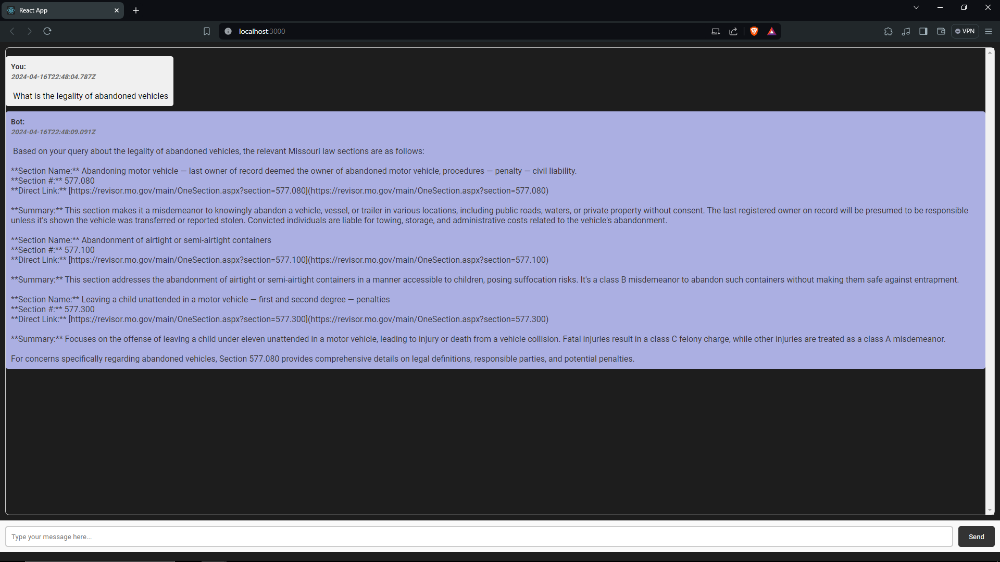

# Sentinel

This is a react web application and server that is powered by an instance of GPT-4 equipped with indexed retrieval augmented generation (RAG) capabilities. The server is responsible for handling the API calls to GPT and the indexed retrieval of Missouri's criminal code. The react app is responsible for the user interface and interaction with the server.

## Process

- I scraped Missouri's criminal code Chapters 556-600 and indexed it by section number. 

- Once indexed, the sections are converted into embeddings and stored in a vector database. 

- A user interacts with the bot by providing a natural language query. This query is then turned into an embedding using (OpenAI's text-embedding-3-large) and a similarity search is performed on the vector database. 

- The most similar 3 sections are returned to the initial API call to GPT and injected into the initial prompt. This achieves an indexed retrieval augmented generation (RAG) interaction with high accuracy.

## Installation

1. Clone the repository

``` bash
git clone repo_link
```


2. Install the dependencies


For react app
``` bash
cd sentinel
npm install
```


For server
``` bash
cd sentinel/server
npm install
```

3. Start the server

``` bash
cd sentinel/server
node server.js
```

4. Start the react app in a new terminal

``` bash
cd sentinel
npm start
```
<br><br><br>

<b>Aside from a lack of better response formatting and UI, here is a functional example of the app:</b>
<br><br>
